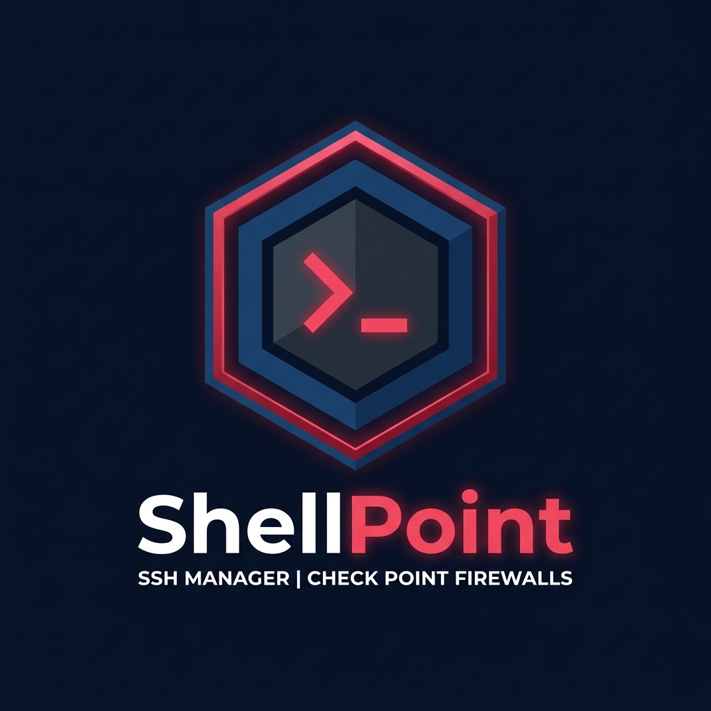

<div align="center">



# ShellPoint

**Professional SSH Manager & SFTP Client for Check Point Firewall Engineers**

[](#)
[](#)
[](LICENSE)
[](https://community.checkpoint.com)

> A portable, zero-install SSH client built for engineers who live inside Check Point firewalls every day.  
> Multi-tab sessions, built-in CP command library, SFTP file manager, flag builders, 2FA support, and more.

</div>

---

## ✨ Features at a Glance

| Category | Features |
|---|---|
| **SSH** | Multi-tab sessions, split-view (HA pairs), Quick Connect, Reconnect, Duplicate session |
| **SFTP** | Side-panel file manager, upload/download with progress, drag & drop |
| **Authentication** | Password, Private Key, Push 2FA (Duo/RADIUS), OTP/Token |
| **Commands** | Built-in Check Point library, custom commands, tcpdump & fw monitor flag builders |
| **Knowledge Base** | Quick links to Check Point SK articles |
| **Host Management** | Customer/cluster grouping, right-click context menus, Gaia Portal shortcut |
| **UI** | Dark mode, right-click copy/paste in terminal, web UI port launcher |
| **Security** | Credentials stored in Windows Credential Manager (not plain text) |
| **Portable** | Single zip, no installation — runs from any folder or USB drive |

---

## 🚀 Quick Start (Portable — No Install)

1. Download `ShellPoint-v1.0.8-win-x64.zip` from [Releases](../../releases)
2. Extract anywhere (Desktop, USB drive, etc.)
3. Run `ShellPoint.exe`
4. Click **+** to add your first firewall host
5. Double-click any host to connect

No Node.js, no setup, no admin rights needed.

---

## 🛠️ Run from Source

If you want to contribute or modify ShellPoint:

**Prerequisites:** [Node.js 18+](https://nodejs.org)

```bash
git clone https://github.com/Fr4nkys/shellpoint.git
cd shellpoint
npm install
npm start
```

### Build a Portable Zip

```bash
npm run dist
# Output → dist/ShellPoint-v1.0.8-win-x64.zip
```

Or use the included `build.bat` on Windows.

---

## 🖥️ System Requirements

| | Requirement |
|---|---|
| **OS** | Windows 10 / 11 (x64) |
| **RAM** | ~150 MB |
| **Disk** | ~350 MB (extracted) |
| **Network** | Direct access to firewall management IP |
| **Node.js** | Only required to build from source |

---

## ⌨️ Keyboard Shortcuts & Tips

| Action | How |
|---|---|
| Connect to host | Double-click host in sidebar |
| Quick Connect | Type `user@ip:port` in the Quick Connect bar (top) |
| Copy terminal text | Select text → right-click → **Copy** |
| Paste into terminal | Right-click → **Paste** |
| Reconnect session | Right-click terminal → **Reconnect** |
| Duplicate session | Right-click terminal → **Duplicate session** |
| Open Gaia Portal | Right-click host in sidebar → **Open Gaia Portal** |
| Open SFTP panel | Click **SFTP** in the toolbar |
| Clear terminal | Right-click terminal → **Clear screen** |

---

## 🔐 Authentication Modes

ShellPoint supports three authentication modes, configurable per host:

| Mode | Use Case |
|---|---|
| **Password only** | Standard SSH password — most common |
| **Push 2FA** | RADIUS/Duo Push — approves automatically on your device |
| **OTP / Token** | RADIUS OTP — prompts for your code at connect time |

Set the mode in **Add/Edit Host → Authentication Mode**.

---

## 📁 Host Organization

Hosts are organized in a two-level tree:

```
├── Customer A
│   └── Site 1
│       ├── fw-node1
│       └── fw-node2  ← [Split] button appears for HA pairs
└── Customer B
    └── Main DC
        └── firewall-01
```

Right-clicking any host shows:
- **Connect** — open SSH session
- **Open Gaia Portal** — launch `https://IP:WebUIPort` in your browser
- **Edit host** — modify host settings
- **Delete host** — remove host

---

## 📂 SFTP File Manager

Click **SFTP** while connected to open a side-panel file manager (takes ~1/3 of the screen):

- Navigate remote directories with breadcrumb navigation
- Download files to `~/Downloads` with one click
- Upload files via drag & drop or the upload button
- Progress bar shows transfer status
- Keepalive prevents session timeout during transfers

---

## 🔧 Built-in Check Point Commands

ShellPoint includes a curated library of Check Point commands:

- `cphaprob stat`, `cphaprob -a if`, `cphaprob list`
- `fw stat`, `fw ctl pstat`, `fw ctl iflist`
- `fwaccel stat`, `fwaccel stats`
- `cpview`, `top`, `df -h`
- **tcpdump flag builder** — visual interface for capture options
- **fw monitor flag builder** — filter expression builder

Custom commands can be added and organized by category.

---

## 🗄️ Data Storage

All user data is stored locally on your machine:

```
%APPDATA%\ShellPoint\
```

| File | Content |
|---|---|
| `config.json` | Hosts, custom commands, settings |
| Windows Credential Manager | SSH passwords (encrypted by the OS) |

To fully reset the app: close it, delete `%APPDATA%\ShellPoint\`, and re-launch.

---

## 🏗️ Project Structure

```
shellpoint/
├── main.js              # Electron main process — SSH, SFTP, IPC, store
├── preload.js           # Minimal preload bridge
├── package.json         # Dependencies and build config
├── src/
│   ├── index.html       # App HTML — all modals and layout
│   ├── renderer.js      # All UI logic — tabs, terminals, SFTP, menus
│   ├── styles/
│   │   └── app.css      # Full design system and component styles
│   ├── data/
│   │   ├── checkpoint-commands.js   # Built-in CP command library
│   │   └── checkpoint-sk.js         # SK article links
│   └── assets/
│       └── logo.png
```

**Key technologies:**
- [Electron](https://www.electronjs.org/) — cross-platform desktop shell
- [xterm.js](https://xtermjs.org/) — terminal emulator
- [ssh2](https://github.com/mscdex/ssh2) — pure-JS SSH/SFTP client
- [electron-store](https://github.com/sindresorhus/electron-store) — persistent config
- [keytar](https://github.com/atom/node-keytar) — OS keychain integration

---

## 🤝 Contributing

Contributions are welcome! This project started as an internal tool for Check Point engineers and is now open source.

1. Fork the repository
2. Create your feature branch: `git checkout -b feature/my-feature`
3. Make your changes and test them: `npm start`
4. Commit: `git commit -m 'Add my feature'`
5. Push: `git push origin feature/my-feature`
6. Open a Pull Request

Please open an issue first for large changes.

---

## 🐛 Known Limitations

- Windows only (x64) — Linux/macOS builds are not currently provided but Electron supports them
- Private key authentication supports unencrypted PEM keys only (passphrase-protected keys not yet supported)
- Split view is limited to 2 terminals side by side

---

## 📬 Community & Support

- **Check Mates**: [community.checkpoint.com](https://community.checkpoint.com)
- **Author**: [Alexandro Michel Davide](https://www.linkedin.com/in/alexandro-davide-b37b9a191/)
- **Website**: [franksec.com](https://franksec.com)

Found a bug? Open an [issue](https://github.com/Fr4nkys/shellpoint/issues) or post in the Check Mates thread.

---

## 📄 License

[MIT](LICENSE) — free to use, modify, and distribute.

---

<div align="center">

Built with ❤️ for the Check Point community

**ShellPoint v1.0.8**

</div>
